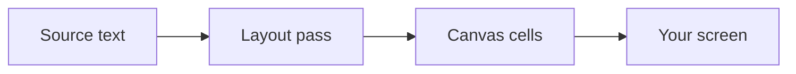
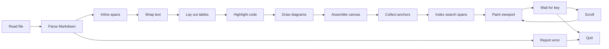

# Field Notes

A pager renders. It does not merely print a file to the screen and let the
terminal fold the long lines wherever they happen to run out of room. Every
paragraph here re-breaks its lines the moment the pane changes width, because
the drawing is a function of the width and nothing else.

Watch the left pane while the divider moves. `less` is doing its honest best
with a file it was never told anything about, so it wraps words mid-glyph and
prints table pipes as pipes.

## Reading room

The three columns below are the smallest thing in this document that argues
back. Narrow the pane and the cells wrap onto two lines; give them sixty
columns and every row settles onto one.

| Instrument | Reading | Remark |
| --- | --- | --- |
| Barometer | 1013 hPa | Steady since dawn, unusual |
| Thermometer | 11 degrees | Falling steadily by morning |
| Anemometer | 22 knots | Gusting harder since noon |

### The same width, three answers

A table renegotiates its column widths. A diagram re-lays its node boxes. Prose
only re-wraps. One drag, three behaviours.



## What will not fit

Some content cannot be talked down. The table below needs sixty columns before
its shortest words start overlapping, which is more than this pane has, so it
scrolls sideways instead of being mangled.

| Station | Altitude | Pressure | Humidity | Observer |
| --- | --- | --- | --- | --- |
| Gornergrat | 3089 | 697 | 41 | Widmer |
| Jungfraujoch | 3571 | 653 | 58 | Kaufmann |
| Saentis | 2502 | 748 | 77 | Brunner |

### A diagram that gave up on reflow

The pipeline below wants one hundred and twenty-seven columns. There is no
width at which folding it would be kind, so under sixty-five it declines to
draw and hands you its source instead, saying how much room it would need.
Give it the room and it draws — and then only the diagram scrolls, while the
prose around it holds still.



## Source, kept

Copy a fenced block and what lands on the clipboard is the source that was
written, not the coloured cells that were drawn.

```rust
fn reading(s: &Sample) -> Option<Reading> {
    let hpa = s.pressure?;
    Some(Reading {
        hpa,
        rising: hpa > s.last,
    })
}
```

Copy a table and it arrives as tab-separated values. Copy a paragraph and it
arrives as Markdown. The status bar says which, every time.

## Where a link goes

A link is content, not chrome, so it is never hidden. Rest the pointer on
[the project page](https://github.com/oetiker/mdmost) and the status bar names
the host before you commit to it; click it and the URL goes to your browser. A
reference to a heading in this same document, such as
[Reading room](#reading-room), scrolls there instead of leaving. Without a
mouse, `f` walks a cursor from one link to the next and `enter` follows
whatever it has landed on[^cursor].

### Following one without a mouse

Nothing here is hidden when the mouse was not captured. A `[copy]` button is
chrome and comes and goes with the pointer, but a link is part of the document
and stays, so `F` steps back through the links this page is showing and `enter`
follows the one it stopped on.

A `#heading` reference is followed without leaving: the heading it names comes
to the top of the viewport and the document is where it was. Only an `http` or
`https` target is handed to a browser — every other scheme is left as the plain
text it was written as, and nothing is opened by accident.

[^cursor]: The cursor is painted, not rendered. It is a difference in how the
    screen is drawn, so moving it never re-lays the page, and it disturbs
    neither a selection nor a search highlight nor where you were reading.

    It walks *controls*, not cells. A link that wrapped across three rows is
    one control and is visited once — which is also why a link inside a table
    cell is reached in the same breath as one in a paragraph.

    Three things share the walk:

    - a link, which opens or scrolls;
    - a `[copy]` button, which copies its block;
    - a footnote marker, which opens a box like this one.

    A note longer than its box scrolls inside it, and the page behind it does
    not move.
