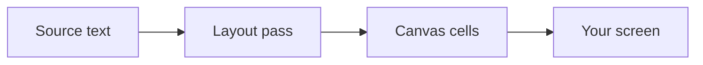
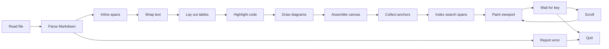

# Field Notes

A pager renders. It does not merely print a file to the screen and let the
terminal fold the long lines wherever they happen to run out of room. Every
paragraph here re-breaks its lines the moment the pane changes width, because
the drawing is a function of the width and nothing else.

Watch the left pane while the divider moves. `less` is doing its honest best
with a file it was never told anything about, so it wraps words mid-glyph and
prints table pipes as pipes.

## Reading room

The three columns below are the smallest thing in this document that argues
back. Narrow the pane and the cells wrap onto two lines; give them sixty
columns and every row settles onto one.

| Instrument | Reading | Remark |
| --- | --- | --- |
| Barometer | 1013 hPa | Steady since dawn, unusual |
| Thermometer | 11 degrees | Falling steadily by morning |
| Anemometer | 22 knots | Gusting harder since noon |

### The same width, three answers

A table renegotiates its column widths. A diagram re-lays its node boxes. Prose
only re-wraps. One drag, three behaviours.



## What will not fit

Some content cannot be talked down. The table below needs sixty columns before
its shortest words start overlapping, which is more than this pane has, so it
scrolls sideways instead of being mangled.

| Station | Altitude | Pressure | Humidity | Observer |
| --- | --- | --- | --- | --- |
| Gornergrat | 3089 | 697 | 41 | Widmer |
| Jungfraujoch | 3571 | 653 | 58 | Kaufmann |
| Saentis | 2502 | 748 | 77 | Brunner |

### A diagram that gave up on reflow

The pipeline below wants one hundred and eighty-eight columns. There is no
width at which folding it would be kind, so under sixty-five it declines to
draw and hands you its source instead, saying how much room it would need.
Give it the room and it draws — and then only the diagram scrolls, while the
prose around it holds still.



## Source, kept

Copy a fenced block and what lands on the clipboard is the source that was
written, not the coloured cells that were drawn.

```rust
fn reading(s: &Sample) -> Option<Reading> {
    let hpa = s.pressure?;
    Some(Reading {
        hpa,
        rising: hpa > s.last,
    })
}
```

Copy a table and it arrives as tab-separated values. Copy a paragraph and it
arrives as Markdown. The status bar says which, every time.
