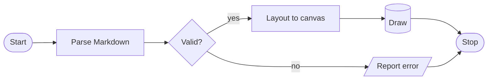

# mdmost — independent visual review

> **Verdict: no — I would not be happy to look at this tool every day.**

> **Filing note.** I was briefed to write `docs/qa/visual-review-2.md` on the understanding that the previous attempt never produced a report. That turned out to be stale: `docs/qa/visual-review-2.md` already existed (24 649 bytes, written 04:29, ~12 minutes before I was dispatched) and `qa-visual2` was still listed as an active teammate. I did not read it — the hard rule against reading `docs/qa/` stood — and I did not overwrite it. This file is therefore filed as `visual-review-3.md`, a genuinely independent second pair of eyes on the same build. Nothing here is informed by any earlier round.

**Built commit:** `2aa5d8ad7f1030ac4fdec3650049bf217f3a2c21` — *"test: the canvas contract is checked on assembled rows, not just cells"* (2 ahead of the `588f7ea` named in my briefing).
**Binary:** `/scratch/oetiker/cargo-target-mdmost-qa-visual3/release/mdmost`, `--release`.
**Reviewer:** independent; did not read any prior file under `docs/qa/`.

## Verdict

**Would I be happy to look at this tool every day? — No.** Close, and much closer than the raw finding count suggests: prose, lists, quotes, tables and code blocks are genuinely handsome, and I would happily read a README in it. But the feature the project leads with — Mermaid as box art — collapses to a raw-source dump on a plain 80-column terminal for an ordinary flowchart, and the diagrams that *do* draw have connectors landing off-centre and labels jammed against lines. A daily driver cannot have its headline feature miss at the most common terminal width.

---

## Editorial note added after filing

The section immediately above is **superseded**. It was accurate for the commit
this review was built against (`2aa5d8a`), where glyph selection had no terminal
probe. The autodetect work merged to `main` as `ba9eeae` shortly afterwards, so
on current `main` glyph use *is* detected and a piped `--render-once` does emit
the plain set. Nothing else in this review is affected: every rendering finding
below concerns box art, colour, margins and layout, all of which are independent
of which glyph set is in force, and every capture passed `--icons`/`--no-icons`
explicitly in any case.

Left in place rather than deleted, because a review that quietly rewrites what it
observed is worth less than one that dates its observations.

## Index by severity

Findings below are numbered in discovery order; this table is the severity ordering.

| # | Severity | Finding |
|---|---|---|
| 1 | **SEVERE** | A seven-node `flowchart LR` will not draw below 92 columns and dumps raw Mermaid source at 80 |
| 15 | **SEVERE** | The live TUI has no left margin and no right gutter — every line, table and code fence is welded to the scrollbar |
| 16 | **SEVERE** | Heading hierarchy is hue-only; every heading is dimmer than body text, and the light theme's six-level ramp is flat (4.80→4.95→4.86:1) |
| 2 | HIGH | Node connectors attach off-centre, sometimes hard against a box corner (`└─────────┬┘`) |
| 3 | HIGH | Rounded elbows mixed with square boxes inside one diagram |
| 8 | HIGH | ER diagram prints one edge label twice, and every label touches its line |
| 9 | HIGH | State diagram duplicates a label and renders `│open│close` with no separation |
| 4 | MEDIUM | Sequence-diagram labels use three different alignments; one collides with the lifeline |
| 5 | MEDIUM | `Note over` box is left-aligned inside itself and sits on the grid at neither end |
| 6 | MEDIUM | Column negotiation starves a table column by exactly one cell, forcing a half-empty row |
| 10 | MEDIUM | Gantt legend silently drops entries that do not fit |
| 11 | MEDIUM | Table overflow chevrons are applied to border rows, so the frame never closes |
| 12 | MEDIUM | "needs more than N columns" always restates the width you have; never names what it needs |
| 17 | MEDIUM | Code panel background is 1.08:1 against the page — the panel is effectively invisible |
| 18 | MEDIUM | Punctuation tokens at 3.00:1 (dark) / 2.61:1 (light), below the AA floor |
| 19 | MEDIUM | TOC indents H5 and H6 identically — depth signal stops at five |
| 20 | MEDIUM | TOC divider has no gutter; prose is glued to the border |
| 22 | MEDIUM | Inline HTML leaves a `⟨html⟩` scar mid-sentence, contradicting the README |
| 7 | LOW | Diamond nodes mix slash-drawn and box-drawn edges |
| 13 | LOW | Footnote bodies land at the document end with no separator |
| 14 | LOW | Thematic-break ornament reuses the H2 marker glyph |
| 21 | LOW | Status bar drops the breadcrumb at width 57 with room to spare |
| 23 | LOW | The good invalid-diagram message is truncated before it finishes its list |
| 24 | **PASS** | Mixed scripts, ZWJ emoji and CJK tables verified aligned at 40 and 80 |
| 25 | note | Search does not match inside code blocks (usability, flagged not assessed) |

---

## Note on the briefing's icon claim

My briefing said glyph use is auto-detected and that a piped `--render-once` shows the plain set. **That is not true of this commit.** `src/main.rs:135` is:

```rust
let icons = (config.icons || cli.icons) && !cli.no_icons;
```

There is no terminal probe in the decision; `io::stdout().is_terminal()` (line 139) only chooses width and whether colour is emitted. Consequence: a piped `--render-once` with no flags emits Nerd Font private-use glyphs (U+F111 as the bullet, U+E695 in code-fence headers), which render as tofu for anyone without a Nerd Font. The autodetect work is unmerged, on branch `icons-autodetect` in the `mdmost-icons` worktree. Every capture below therefore passes `--icons` or `--no-icons` explicitly.

Also note: piped `--render-once` goes through `dump::write_plain`, so **piped output carries no colour at all**. All colour/contrast judgements below come from live tmux captures, not from pipes.

---

## Findings, worst first

### 1. SEVERE — A seven-node flowchart will not draw at 80 columns; it dumps raw Mermaid source

**Where:** `flowchart LR`, width 80 (also 84, 88), both themes, both icon settings.

Probe (`scratchpad/probe/flow.md`):



At width 80 the captured frame is:

```
 ╭ mermaid ───────────────────────────────────────────────────────────────────╮
 │ flowchart LR                                                               │
 │     Start([Start]) --> Parse[Parse Markdown]                               │
 │     Parse --> Check{Valid?}                                                │
 │     Check -->|yes| Layout[Layout to canvas]                                │
 │     Check -->|no| Error[/Report error/]                                    │
 │     Layout --> Draw[(Draw)]                                                │
 │     Draw --> Stop([Stop])                                                  │
 │     Error --> Stop                                                         │
 ╰ needs more than 78 columns to draw ────────────────────────────────────────╯
```

Bisected threshold — fallback at 80/84/88, draws from 92:

```
w=84 -> 1   (1 = fell back)
w=88 -> 1
w=92 -> 0
w=96 -> 0
```

**Why it is wrong.** 80 columns is *the* default terminal width, and this is a small, entirely ordinary chart. The README's pitch is "Mermaid diagrams are laid out as box art rather than shown as source" — at 80 columns this document shows source. The failure is also silent-ish: the reason hides in the fence *footer*, where it reads as decoration rather than as an explanation.

**How bad:** worst finding in the review. It is the difference between the tool's headline claim being true and being false on a default terminal.

**Mitigating:** the same graph as `flowchart TD` draws fine at 80 and looks good (see "What looks good"). So the layout engine is capable; it is the LR path's width budget that overruns. A reader has no way to know that re-orienting the graph would fix it.

---

### 2. HIGH — Node connectors attach off-centre, sometimes at the box corner

**Where:** `flowchart TD` width 80, `classDiagram` width 80; both themes; icon setting irrelevant (box art is unaffected by icons).

The `Draw[(Draw)]` cylinder in `flowchart TD` at width 80:

```
                                        ╭──────╮
                                        ├──────┤
                                        │ Draw │
                                        ├──────┤
                                        ╰─────┬╯
                                              ╰──╮ ╰╮
                                                 ▼  ▼
                                               ╭──────╮
                                               ( Stop )
                                               ╰──────╯
```

The exit connector `┬` on the cylinder's bottom edge sits one cell from the right corner (`╰─────┬╯` — five dashes left of it, zero right), not at the centre. Every other box in the same diagram centres its connector, e.g. `└────────┬───────┘` under *Parse Markdown*. The eye reads the off-centre stub as a rendering fault.

Same class of fault in `classDiagram` at width 80 — the inheritance edge meets *Paragraph* at its right corner but *CodeBlock* at its centre, in the same row:

```
                                  │ +render(): Canvas │
                                  └────┬─────────┬────┘
                                       △         △
                                 ╭─────╯    ╭────╯
                      ┌──────────┴┐   ┌─────┴─────┐
                      │ Paragraph │   │ CodeBlock │
                      └───────────┘   └───────────┘
```

`┌──────────┴┐` — the `┴` is at the eleventh of eleven inner cells, hard against the `┐`. `┌─────┴─────┐` next to it is properly centred. Two sibling boxes in one row, connected two different ways.

**Why it is wrong:** it is the most legible kind of "this is broken" signal in box art. Lines that meet boxes at corners read as accidents.

**How bad:** high. Visible in the first diagram most users will draw.

---

### 3. HIGH — Mixed corner vocabulary inside a single diagram

**Where:** `classDiagram` and `flowchart TD`, all widths, both themes.

In the capture above, class boxes use square corners (`┌ ┐ └ ┘`) while the elbows joining them use rounded ones (`╭ ╯`): `╭─────╯    ╭────╯`. In `flowchart TD` the same diagram mixes square boxes (`┌ Parse Markdown ┐`), rounded stadium nodes (`╭ ( Start ) ╰`), and rounded elbows (`╰─────────────╮`) on the edges between them.

Rounded corners for stadium/round-edged Mermaid shapes are a deliberate and correct distinction. Rounded corners on *edge elbows* are not — they make the connecting lines look like they belong to a different drawing than the boxes they connect.

**How bad:** high on the aesthetics axis specifically, which is what this review is for. Nothing is misdrawn; it just looks unconsidered.

---

### 4. MEDIUM — Sequence-diagram labels are inconsistently placed and one is jammed against the lifeline

**Where:** `sequenceDiagram`, width 80, both themes.

```
                      ┆ press j  ┆                     ┆
                      ┆──────────▶                     ┆
                      ┆          ┆render(width, theme) ┆
                      ┆          ┆─────────────────────▶
                      ┆          ┆       canvas        ┆
                      ┆          ◀╌╌╌╌╌╌╌╌╌╌╌╌╌╌╌╌╌╌╌╌╌┆
                      ┆  frame   ┆                     ┆
                      ◀╌╌╌╌╌╌╌╌╌╌┆                     ┆
```

Three different label treatments in eight rows:
- `┆ press j  ┆` — one space of padding, left-biased.
- `┆render(width, theme) ┆` — **no space at all** on the left; the `r` of `render` touches the lifeline glyph.
- `┆       canvas        ┆` — centred.

The middle one is the bug: when a label exactly fills its span the padding is dropped on one side only, so the text collides with the lifeline. The other two show the intended styles disagreeing with each other about centring.

**How bad:** medium. Not broken, but it is the kind of raggedness that makes a diagram look machine-vomited rather than typeset.

---

### 5. MEDIUM — The `Note over` box is left-aligned inside itself and breaks the lifeline grid

**Where:** `sequenceDiagram`, width 80, both themes.

```
                      ◀╌╌╌╌╌╌╌╌╌╌┆                     ┆
                      ┆         ╭───────────────────────╮
                      ┆         │ rendering is pure     │
                      ┆         ╰───────────────────────╯
                      ┆          ┆                     ┆
```

The note box is 23 cells of inner width for 17 cells of text, and the text is flush left with six cells of dead space at the right — every other label in the same diagram is centred. The box also extends past the Renderer lifeline column on the right while starting one cell left of the Pager lifeline, so it sits on the grid at neither end.

**How bad:** medium.

---

### 6. MEDIUM — Column-width negotiation gives a table a needless two-line row

**Where:** any table where one column is much wider than the others; width 80, both themes.

```
 ╭───────────────────────────────────────────────────────────────┬────────────╮
 │ construct                                                     │ rendered   │
 ├───────────────────────────────────────────────────────────────┼────────────┤
 │ bold and em                                                   │ inline     │
 │                                                               │ code       │
 │ a link                                                        │ struck     │
 │ a very long cell value that has no choice but to wrap inside  │ short      │
 │ its own column                                                │            │
 ╰───────────────────────────────────────────────────────────────┴────────────╯
```

Column 2's widest content is `inline code` — 11 cells. It was given 12 total, i.e. **10 usable** after padding, so `inline code` wraps to two lines. Column 1 is 63 wide and wraps anyway. Moving a single column from 1 to 2 would have removed a whole row from the table at no cost to column 1, which is already over budget.

The negotiator is spending its slack on the column that cannot use it and starving the one that can, by exactly one cell.

**How bad:** medium — small in isolation, but it fires on the very common "wide description column plus short value column" shape, and off-by-one column starvation is conspicuous because the row it creates is half empty.

---

### 7. LOW — Diamond nodes mix slash-drawn and box-drawn edges

**Where:** `flowchart LR` width 100, `flowchart TD` width 80.

```
                                               ╱──────╲
                                              │ Valid? │
                                               ╲───┬──╱
```

The top and bottom edges are `╱ ╲` diagonals; the sides are `│` verticals. The result is neither a diamond nor a box — the verticals are full height while the diagonals cover one row each, so the shape reads as a box with clipped corners. At `flowchart LR` it is worse, because the right side becomes a `├` tee: `│ Valid? ├┴─────▶`.

Also in that LR frame, the branch label has no padding: `│yes` — same collision class as finding 4.

**How bad:** low. Legible, just not pretty.

---

### 8. HIGH — ER diagram prints the same edge label twice, and every edge label touches its line

**Where:** `erDiagram`, widths 40 and 80 (identical defect at both), both themes.

Width 40 capture:

```
   ┌──────────┐   ┌─────────┐
   │ CUSTOMER │   │ PRODUCT │
   └─────────┬┘   └────┬────┘
             ┼         ┼
             ┼         ┼
             │places   │ordered in
             ○         │
             ∧         │
           ┌───────┐   │
           │ ORDER │   │
           └──────┬┘   │
                  ┼    │
                  ┼    │
                  ╰─╮  ╰──╮
                    │contains
                    │     │ordered in
                    ┼     ○
                    ∧     ∧
                 ┌───────────┐
                 │ LINE_ITEM │
                 └───────────┘
```

Source has exactly three relationships. `ordered in` is printed **twice** — once on row 6 next to PRODUCT's descending edge, once again on row 16 further down the same edge. `places` and `contains` each appear once. So a long routed edge gets its label re-stamped at each segment, and the reader counts four relationships where there are three.

Every label also abuts its line with zero padding: `│places`, `│ordered in`, `│contains`. Same collision class as finding 4, but here it is on every edge in the diagram rather than one.

Two further problems visible in the same frame:
- The cardinality ticks are drawn as `┼` stacked on consecutive rows. `┼` is a four-way cross; on a vertical edge it reads as an intersection with an invisible horizontal line, not as the "exactly one" tick pair it is meant to be.
- Connector attachment is corner-adjacent on CUSTOMER (`└─────────┬┘`) and on ORDER (`└──────┬┘`) but centred on PRODUCT (`└────┬────┘`) — finding 2 again, here affecting two of the four boxes.

**How bad:** high. A duplicated label is a correctness-level visual defect, not a polish one.

---

### 9. HIGH — State diagram also duplicates a label and stacks two labels with no separation

**Where:** `stateDiagram-v2`, widths 40 and 80, both themes.

```
                     ╭──────╮
                     │ Idle │
                     ╰─┬──┬─╯
                       │  ▲
                    ╭──╯ ╭╯
                    │open│close
                    ▼    │
           ╭─────────╮   │
           │ Loading │   │
           ╰──┬───┬──╯   │
              │   ╰────╮ ╰─╮
              │error   │ready
              │        │   │close
              ▼        ▼   │
       ╭────────╮   ╭──────┴──╮
       │ Failed │   │ Viewing │
       ╰────┬───╯   ╰─────────╯
            ▼
            ◉
```

`close` is printed twice (row `│open│close` and row `│   │close`) for the single `Viewing --> Idle : close` transition. `│open│close` puts two different edge labels flush against each other and against their lines, with no space anywhere in the run — it reads as one token `openclose`.

`Viewing`'s incoming connector is again corner-biased: `╭──────┴──╮`, `┴` at cell 7 of 9.

**How bad:** high, same reasoning as finding 8.

---

### 10. MEDIUM — The gantt legend silently drops entries that do not fit

**Where:** `gantt`, width 40 vs width 80, both themes.

Width 80:

```
              █ done   █ active   █ planned
```

Width 40, same document, same tasks:

```
              █ done   █ active
```

`planned` is gone with no ellipsis, no marker, nothing. The reader at 40 columns is shown a two-state legend for a three-state chart and has no way to know a state is missing. Truncation elsewhere in this renderer is always marked (`›` in tables, `…` in sequence labels); the legend is the one place it is silent.

**How bad:** medium — a legend that lies is worse than a legend that is cut off visibly.

---

### 11. MEDIUM — Table horizontal overflow leaves the box with no right-hand wall

**Where:** any table wider than the viewport; width 40, both themes.

```
 ╭───────────┬────────────────┬───────›
 │ Component │ Responsibility │ Owner ›
 ├───────────┼────────────────┼───────›
 │ renderer  │ turns the      │ core  ›
 │           │ parsed         │       ›
 ...
 ╰───────────┴────────────────┴───────›
```

The `›` overflow marker is applied uniformly to *every* row including the three border rows, so the table's top, middle and bottom rules terminate in a chevron instead of `╮ ┤ ╯`. The frame therefore never closes and the shape stops reading as a table.

It also gives no sense of scale: two of five columns (`Status`, `Notes`) are entirely off-screen and nothing says how many, or how far right the content goes.

**How bad:** medium. The chevron is a defensible affordance; applying it to the border glyphs is what makes it look broken rather than scrollable.

---

### 12. MEDIUM — The "cannot draw" message never tells you what it actually needs

**Where:** `flowchart LR`, every width below the threshold.

At width 57 the footer reads:

```
 ╰ needs more than 55 columns to draw ─────────────────╯
```

At width 80:

```
 ╰ needs more than 78 columns to draw ────────────────────────────────────────╯
```

The number is always *the width you already have* (minus the two-cell frame), so the sentence is a tautology — it never names the 92 columns the diagram actually requires. A reader widening the terminal from 80 gets the same message at 84 and 88 and has no way to know when to stop.

**How bad:** medium. It converts a recoverable situation into a guessing game.

---

### 13. LOW — Footnote bodies land at the end of the document with no separator at all

**Where:** width 80, both themes, both icon settings.

Last three lines of the rendered probe document:

```
 Paragraph three, the last of the filler, exists so the end-of-document
 behaviour is visible without a separate probe file.

 [1] footnote body text.
```

No rule, no heading, no indent change — the footnote body is one blank line below the closing paragraph and is styled like body prose. It reads as a stray line rather than as apparatus. Every other block in the renderer gets a visual frame of some kind; this one gets none.

**How bad:** low, but it is the last thing a reader sees in any document with footnotes.

---

### 14. LOW — The thematic-break ornament reuses the H2 marker glyph

**Where:** `---` at every width, plain-glyph mode.

```
              ─────────────────────────◈──────────────────────────
```

The centred rule is nicely done and the centring is exact (measured: 14 cells of margin either side at width 80, 7/7 at 40, 10/10 at 57, 20/20 at 120). But the ornament is `◈`, which is the **same glyph used as the H2 heading marker** (` ◈ H2 Section`). In a document that alternates sections and rules, the same diamond means "section heading" in one place and "nothing, decoration" in another.

**How bad:** low.

---

### 15. SEVERE — In the live TUI there is no left margin and no right gutter; content is welded to the scrollbar

**Where:** every document, every width, both themes, both icon settings. Live TUI only — `--render-once` does *not* have this defect.

`tmux new-session -d -s mdv -x 80 -y 30`, probe document, dark theme:

```
 H1 Document Title                                                            █
━━━━━━━━━━━━━━━━━━━━━━━━━━━━━━━━━━━━━━━━━━━━━━━━━━━━━━━━━━━━━━━━━━━━━━━━━━━━━━━█
                                                                               │
Intro paragraph before any subheading, long enough to wrap at eighty columns so│
that the wrapping behaviour and the left margin are both visible in one glance.│
```

Measured: every row is exactly 80 cells; body text occupies columns 1–79 and the scrollbar is column 80. The word `so` ends at column 79 and the scrollbar glyph begins at column 80 — **zero cells of separation**. There is likewise no left margin: the heading glyph sits in column 1.

The same document through `--render-once --width 80` has a one-column left margin (` ◆ H1 Document Title`), so the two render paths disagree about margins and the interactive one — the one users actually look at — is the tighter of the two.

It is worst on framed blocks, where the block's own right border lands next to the scrollbar and produces a doubled rule:

```
╭───────────┬─────────────────────────────────────┬──────────┬────────┬───────╮│
│ Component │ Responsibility                      │ Owner    │ Status │ Notes ││
├───────────┼─────────────────────────────────────┼──────────┼────────┼───────┤│
│ renderer  │ turns the parsed document into a    │ core     │   ok   │    12 ││
│ mermaid   │ lays diagrams out as box art        │ diagrams │  wip   │     5 ││
╰───────────┴─────────────────────────────────────┴──────────┴────────┴───────╯││
```

Every row ends `││`, and the corners read `╮│` and `╯│`. At a glance the table looks like it has a broken double border. Code fences do the same thing, and there it is worse still: the fence border and the scrollbar track are **the same colour** (`#39414f` in dark), so the two merge into one 2-cell smear.

**Why it is wrong:** this is not a construct-specific bug, it is the page frame. It affects every line of every document the tool will ever show. A one-column gutter either side is the single cheapest change in this list and the one that would most change the impression the tool makes.

**How bad:** severe on the "pleasant to look at" axis specifically, which is the axis this review is for. `btop` would never let a glyph touch its scrollbar.

---

### 16. SEVERE — Heading hierarchy is carried almost entirely by hue; every heading is *less* prominent than body text, and the light theme's ramp is flat

**Where:** all six heading levels, both themes, all widths.

Colours read directly off `tmux capture-pane -e` (truecolour SGR):

Dark theme — page bg `#11141b`, body text `#d6dbe5`:

| level | colour | contrast vs bg | relative luminance |
|---|---|---|---|
| body text | `#d6dbe5` | **13.27:1** | 0.706 |
| H1 | `#64b5ff` | 8.42:1 | 0.430 |
| H2 | `#68adef` | 7.73:1 | 0.391 |
| H3 | `#6ca6df` | 7.16:1 | 0.358 |
| H4 | `#709ecf` | 6.56:1 | 0.324 |
| H5 | `#7397bf` | 6.06:1 | 0.295 |
| H6 | `#778faf` | 5.56:1 | 0.267 |

Two problems, both measured:

**(a) Every heading is dimmer than the prose it introduces.** H1 sits at luminance 0.430 against body text at 0.706 — the document *title* is 40 % less luminous than the paragraphs beneath it. Blue is the lowest-luminance hue available, so a blue heading ramp against near-white body text fights the hierarchy instead of carrying it. H1 and H2 survive because they also get bold and a rule. H4/H5/H6 get **neither** — checked in the escape stream, `^[[1m` is present for H1–H3 and absent for H4–H6 — so from H4 down a heading is simply dimmer-than-normal blue text, i.e. *less* salient than the body copy around it.

**(b) Adjacent levels are indistinguishable.** Contrast between neighbouring heading colours:

```
H1 vs H2 : 1.089:1        H4 vs H5 : 1.083:1
H2 vs H3 : 1.080:1        H5 vs H6 : 1.091:1
H3 vs H4 : 1.090:1
```

1.00:1 is identical. These are all under 1.1:1 — far below what anyone can see, especially on text separated by several lines of prose. The six-step ramp is, perceptually, one step. The only real differentiator between H3, H4, H5 and H6 is the one-cell marker glyph (`◇ ▸ ▹ ❯`).

**The light theme is worse — the ramp is flat and slightly inverted.** Page bg `#fdfcf9`, body `#2b2f38`:

```
body vs bg : 13.07:1
H1 : 4.80:1     H4 : 4.95:1
H2 : 4.89:1     H5 : 4.90:1
H3 : 4.92:1     H6 : 4.86:1
```

H1 has the *lowest* contrast of all six. Every heading sits at ~4.9:1 while body text sits at 13.07:1, so in the light theme headings are roughly **a third** the contrast of the prose. H1 at 4.80:1 barely clears the 4.5:1 AA floor — for a document title on the tool's own light theme, that is not enough.

**Why it is wrong:** the one job a document renderer has beyond "show the words" is to make structure visible at a glance. Here the structure is the faintest thing on screen.

**How bad:** severe. It is the reason a long README in this tool feels flat even though every individual block is well drawn.

---

### 17. MEDIUM — The code panel is not visually a panel

**Where:** every fenced code block, both themes, all widths.

Measured backgrounds:

```
DARK   page bg #11141b   code bg #181c25   ->  1.08:1
LIGHT  page bg #fdfcf9   code bg #f1efe9   ->  1.12:1
DARK   fence border #39414f vs page bg     ->  1.79:1
LIGHT  fence border #c3c0b6 vs page bg     ->  1.77:1
```

A 1.08:1 background delta is a seven-unit shift per channel — on a good many monitors that is literally not visible, and on a projector or a washed-out laptop panel it certainly is not. The border at 1.79:1 is the only thing holding the block together, and it is nearly as faint. The renderer goes to the trouble of drawing a rounded box with a language label in the top rail, and then paints it in a colour that all but disappears.

Combined with finding 15, the right-hand border of a code block is a faint grey line directly against an identically-coloured scrollbar.

**How bad:** medium. Nothing is misdrawn; the design intent simply does not survive contact with a real display.

---

### 18. MEDIUM — Punctuation tokens fall below readable contrast in both themes

**Where:** all syntax-highlighted code, both themes.

Token contrast against the code background:

```
                DARK      LIGHT
code text      12.28:1    (body)
param          11.58:1
string          9.74:1
keyword         7.39:1     5.90:1
function        6.77:1
comment         4.66:1     4.20:1
punctuation     3.00:1     2.61:1     <-- 
```

In the Rust sample, `::`, `{`, `}`, `(`, `)`, `&`, `[`, `]` are all painted `#5e6779` (dark) / `#93959 8` (light). Dimming punctuation is a legitimate and popular style, but 3.00:1 and 2.61:1 are past the point where it reads as "de-emphasised" and into "hard to see" — and in Rust and JSON specifically, the punctuation *is* the structure. `HashMap<String, usize>` loses its angle brackets.

Light-theme comments at 4.20:1 are also under the AA floor.

**How bad:** medium.

---

### 19. MEDIUM — The table of contents indents H5 and H6 identically

**Where:** TOC pane (`Tab`), width 80, both themes.

```
╭  Contents ────────────────╮
│▸ H1 Document Title         │
│    H2 Section              │
│      H3 Subsection         │
│        H4 Sub-subsection   │
│          H5 Deeper         │
│          H6 Deepest        │
│    Lists                   │
```

The indent steps 2 → 4 → 6 → 8 → 10 and then **stops**: H5 and H6 both sit at ten spaces. In a TOC, indent is the only structural signal there is, so at depth six the pane simply stops telling you the depth. Documents that use H5/H6 (API references, RFC-shaped specs — exactly this tool's material) get a TOC that flattens at the bottom.

**How bad:** medium.

---

### 20. MEDIUM — The TOC divider has no gutter either

**Where:** TOC pane open, width 80, both themes.

```
│      H3 Subsection         │Intro paragraph before any subheading, long      │
│        H4 Sub-subsection   │enough to wrap at eighty columns so that the     │
...
╰────────────────────────────╯1. ordered one                                   │
```

Document text begins in the cell immediately right of the TOC's border — `│Intro`, `╯1. ordered one`. Same defect as finding 15, now on the left edge as well, and here it is more jarring because the border is a solid vertical rule running the full height with prose glued to it for every one of those rows.

Note also that the TOC is 30 columns wide and still truncates its longest entry (`Long prose for scrolli…`) by one character, while the pane itself has spare room.

**How bad:** medium.

---

### 21. LOW — The status bar drops the breadcrumb at narrow widths while leaving room for it

**Where:** status line, widths 57 and 40, both themes.

Width 80:

```
 󰈙 probe.md    0% ░░░░░░░░   H1 Document Title                        h help
```

Width 57 — same document, same position:

```
 󰈙 probe.md    0% ░░░░░░░░                       h help
```

The breadcrumb group is dropped entirely, leaving 23 blank cells in the middle of the bar. The dropped group is a separator, an icon and `H1 Document Title` — about 20 cells. **It would have fitted.** So the bar loses information *and* looks hollow, in exchange for nothing. Truncating to `H1 Docum…` would have been both more useful and better balanced.

At width 40 the drop is justified (6 spare cells); the reserved gap still reads as a hole.

**How bad:** low.

---

### 22. MEDIUM — Inline HTML leaves a `⟨html⟩` scar in the middle of a sentence

**Where:** `tests/corpus/adversarial.md`, width 80, both themes.

README states: *"No HTML. Raw HTML in the source is skipped rather than rendered or shown."* What actually happens:

```
 ◈ HTML is not supported
 ──────────────────────────────────────────────────────────────────────────────

 ⟨html⟩

 Inline ⟨html⟩ html is dropped too.
```

The source second line is `Inline <b>html</b> is dropped too.` The opening `<b>` is replaced by a visible `⟨html⟩` placeholder and the closing `</b>` by nothing, so the rendered sentence is grammatically broken — a reader sees a stray marker wedged between "Inline" and "html".

The block case (`<div class="callout">` wrapping a sentence) collapses to a bare `⟨html⟩` on its own line: correct in that the content is dropped, but the marker is unexplained and, at block level, `⟨html⟩` alone in the middle of a document reads as a rendering failure rather than a deliberate omission.

For inline HTML specifically, the placeholder is worse than the silent skip the README promises: bold/italic `<b>`/`<i>` tags are common in otherwise-plain Markdown, and every one of them will now plant a marker mid-sentence.

**How bad:** medium. It is also a documentation mismatch — either the README or the behaviour is wrong.

---

### 23. LOW — The (otherwise excellent) invalid-diagram message is truncated mid-word

**Where:** unrecognised `mermaid` fence, width 80.

```
 │ this is not valid mermaid at all                                           │
 ╰ not a diagram type — mdmost draws flowchart, sequenceDiagram, classDiagra… ╯
```

This message is *far* better than the one in finding 12 — it says what went wrong and starts listing what is supported. But it is cut at `classDiagra…`, so five of the seven supported types are never named. The whole value of the message is the list, and the list does not fit.

Worth contrasting with finding 12: the codebase clearly knows how to write a useful fallback message. The width-budget message just isn't one.

**How bad:** low.

---

### 24. PASS — Mixed scripts, emoji and CJK tables are correct; my own measuring script was the thing that was wrong

Recorded explicitly because the brief asks me to say when an area is fine, and because this is a nontrivial pass.

`tests/corpus/adversarial.md` at width 40, live in tmux, the CJK/emoji table:

```
╭──────────────┬─────────┬────────────╮│
│ Left         │ Centre  │      Right ││
├──────────────┼─────────┼────────────┤│
│ em           │  code   │          1 ││
│ a list:      │  bold   │ 1234567890 ││
│ not html     │  and a  │            ││
│              │  link   │            ││
│ 日本語のセル │   👩‍💻    │         -1 ││
╰──────────────┴─────────┴────────────╯│
```

Every border column lines up, including across the double-width CJK row and the ZWJ emoji row. Verified against tmux's own cell grid rather than by eye — that last row is 35 codepoints occupying exactly 40 cells:

```
row20 chars= 40 eawidth= 40   '│ Left         │ Cen'
row25 chars= 40 eawidth= 40   '│              │  li'
row26 chars= 35 eawidth= 42   '│ 日本語のセル │   👩‍💻    '
```

My `wcheck.py` scored that row 42 and flagged it as overflowing, because it sums East-Asian widths per codepoint and therefore counts `👩‍💻` (U+1F469 ZWJ U+1F4BB) as two wide emoji = 4 cells. tmux renders the ZWJ sequence as **one** 2-cell grapheme, and mdmost agrees with tmux: 26 narrow + 6 CJK×2 + 1 cluster×2 = 40. **mdmost is right and my script was wrong**; the single "OVER" it reported across the whole adversarial corpus is an artefact of my measurement, not a defect.

That means grapheme clustering is being done properly, not codepoint counting — which also holds for the Tangut-plus-Tai-Tham three-column cluster, the combining-accent `café` (decomposed) versus precomposed `café`, the ZWSP, the flag `🇨🇭` and the skin-tone `👍🏽`, all of which render inside the 40-column budget with no overflow:

```
日本語のテキストと English
が混ざった段落です。مرحبا بالعالم —
नमस्ते दुनिया. Emoji: 👩‍💻 🇨🇭 👍🏽 and a
combining sequence: café (decomposed)
and café (precomposed). A cluster wider
than a terminal cell: 𗀀ᩗ (a Tangut
base plus a spacing Tai Tham mark: one
grapheme, three columns) and a
zero-width space: a​b.
```

RTL Arabic and Devanagari sit in the same paragraph as Latin and CJK without breaking the wrap. The 62-character unbreakable token is hard-broken at the boundary rather than allowed to overflow. Across the whole adversarial corpus at width 80: **0 lines overflowing**.

This is the strongest single area of the renderer.

---

### 25. NOTE (outside my remit) — search does not match inside code blocks

Not a visual finding, and usability belongs to another reviewer, but I hit it while navigating and it is worth someone's attention. Search finds prose and finds table-cell text:

```
 󰈙 probe.md   End ████████                       scrolling filler 1/2  h help
 󰈙 probe.md   27% ██▏░░░░░   Tables                  negotiates 1/1  h help
```

but finds nothing inside a fenced code block, for strings that are plainly on screen:

```
 󰈙 probe.md    0% ░░░░░░░░   no match for `HashMap`       HashMap 0  h help
 󰈙 probe.md    0% ░░░░░░░░   no match for `Docstring`   Docstring 0  h help
```

`HashMap` and `Docstring` are both visible in the rendered Rust and Python blocks. For a pager aimed at technical documents, code is the text people most want to search.

---

## What genuinely looks good — do not break these

This list is not padding. Several of these are better than what most terminal Markdown renderers manage, and the findings above are worth fixing precisely because the surrounding work is strong.

**The pie chart is the best-looking thing in the tool.** Width 80, light theme:

```
                              Where the time went

● Layout   ████████████████████████████████████████████████████████████   45.0%
● Drawing  █████████████████████████████████▍                             25.0%
● Parsing  ████████████████████                                           15.0%
● Waiting  ████████████████████                                           15.0%
   ──────────────────────────────────────────────────────────────────────────
   Total                                                                 100.0%
```

Rendering a pie as a sorted horizontal bar chart is the right call for a terminal — it is readable, it sorts largest-first, the percentages are right-aligned in their own column, and the total rule closes it off. Sub-cell partial blocks (`▍`, `▊`, `▋`) give it real resolution. The categorical palette is four well-separated hues (`#1a6fd4` blue, `#1f7a4d` green, `#b35c00` orange, `#6b3fc0` purple) and — importantly — **the label sits next to its own swatch**, so the chart does not depend on colour to be read. It scales down to width 40 without losing anything.

**The gantt chart.** Date labels are correctly centred on their ticks, sections are indented under their headings, and the `done`/`active`/`planned` states are distinguished. It stays legible at 40.

**`flowchart TD` at width 80** is genuinely good box art — proper stadium nodes for `([...])`, a diamond for `{...}`, correct edge routing with `yes`/`no` branches rejoining at `Stop`, and connectors that (the cylinder aside) meet their boxes centred.

**Syntax highlighting is well judged.** Keywords `#b99bf8`, functions `#7aa2f7`, strings `#76d7a0`, comments italic (`^[[3m`) — italic comments in a terminal is a nice touch. Doc comments, f-string interpolation and parameter names are all coloured distinctly. Everything except punctuation clears AA comfortably.

**Tables at 80 and above are excellent.** Per-column alignment from the delimiter row is honoured exactly (`│ left     │  center  │    right │`), borders are clean rounded box-drawing, cells wrap inside their own column, and Markdown inside cells is parsed rather than shown raw.

**Lists.** Three distinct nesting markers (`•` `◦` `⁃`), correct hanging indent on wrapped items, real checkbox glyphs (`☐` `☑`), and ordered lists renumber per CommonMark. Wrapped list text lines up under the text, not the marker:

```
 ☐ a long unchecked task whose text wraps across more than one line to show the
   hanging indent for task items
```

**Block quotes** nest correctly with a repeated `▌` bar, and — nicely — carry lists and code fences inside the quote with the bar continuing down the left of the fence.

**Resize reflow is instant and correct.** `tmux resize-window` from 80 → 57 → 40 → 80 reflowed prose, tables and diagrams every time with no artefacts and no scroll-position loss.

**Layout never overflows its budget.** Measured across the whole probe document at four widths, after stripping SGR and accounting for East-Asian width and combining marks:

```
width  40 : lines=376 max=39  overflowing=0
width  57 : lines=357 max=56  overflowing=0
width  80 : lines=344 max=79  overflowing=0
width 120 : lines=333 max=119 overflowing=0
```

Not one line exceeds the target at any width. That is a real achievement for a renderer with this many block types.

**Icon and plain-glyph modes are width-identical.** Rendering the probe document at width 80 with `--icons` and `--no-icons` and comparing display width line by line: **0 of 344 lines differ in width.** The `--no-icons` promise of "the same display width" holds exactly. The plain fallback set is also well chosen (`◆ ◈ ◇ ▸ ▹ ❯` for headings, `• ◦ ⁃` for lists, `☐ ☑` for tasks) — the plain mode does not feel like a downgrade.

**Thematic-rule centring is exact** — measured margins of 7/7 at width 40, 10/10 at 57, 14/14 at 80, 20/20 at 120.

**The scrollbar uses half-block glyphs for sub-cell precision** (`▄ █ ▀`), which is exactly the btop-grade detail the project is aiming at.

**The help overlay is well typeset.** Keys right-aligned to a common column, descriptions left-aligned to another, grouped under section headings, with a live scroll hint in the bottom rail (`╰ ↓ 10 more — j k scroll ─╯`) that updates to `╰ ↑ k scrolls back ─╯` at the end.

**Image placeholders** are handled with the same fence treatment as code, labelled `image`, showing alt text and target on separate lines — and they degrade sensibly when there is no alt text.

**The sequence diagram's overall geometry is right** — lifelines aligned under participant centres, solid arrows for calls and dashed (`╌`) for returns, participant boxes repeated at the foot. The complaints in findings 4 and 5 are about label padding, not structure.

