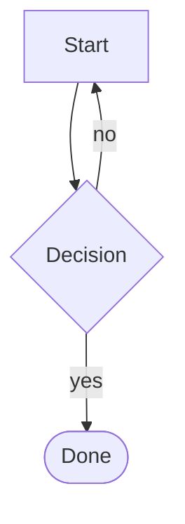
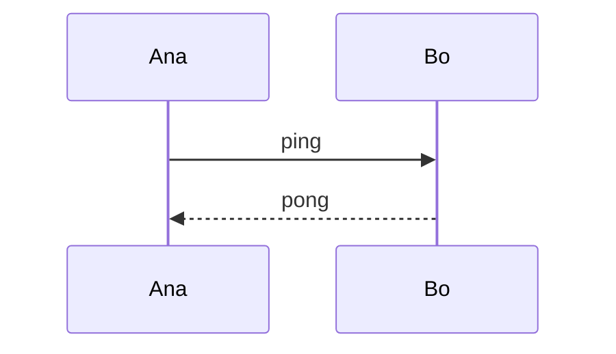
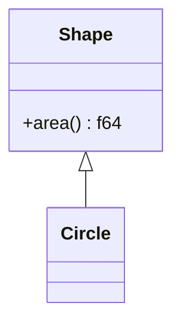
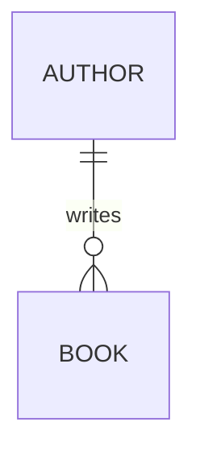
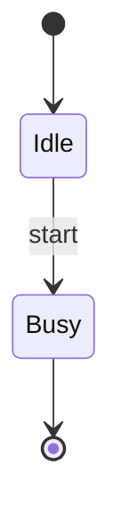
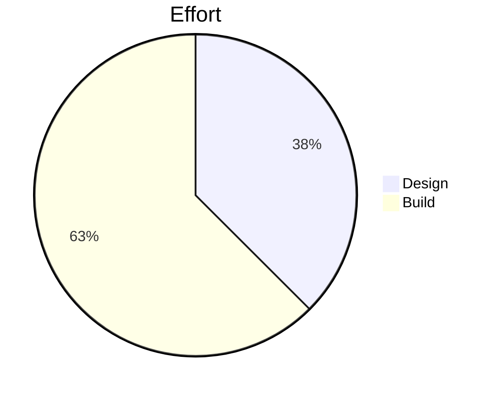
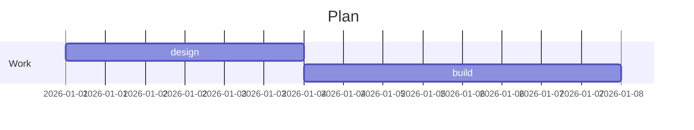
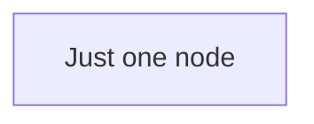

# mdless torture test

A paragraph with *emphasis*, **strong**, ~~strikethrough~~, `inline code`, a
[link](https://example.com "with a title") and an autolink
<https://example.org/very/long/path/that/will/not/fit/in/forty/columns>.

## Mixed scripts

日本語のテキストと English が混ざった段落です。مرحبا بالعالم — नमस्ते दुनिया.
Emoji: 👩‍💻 🇨🇭 👍🏽 and a combining sequence: café (decomposed) and café (precomposed).
A cluster wider than a terminal cell: 𗀀ᩗ (a Tangut base plus a spacing
Tai Tham mark: one grapheme, three columns) and a zero-width space: a​b.

An unbreakable-token stress case:
supercalifragilisticexpialidociousantidisestablishmentarianism

## Lists

- level one
  - level two with a longer line that has to wrap somewhere sensible
    - level three
      1. ordered inside unordered
      2. second
- [x] a finished task
- [ ] an unfinished task

## Table with Markdown inside cells

| Left | Centre | Right |
|:-----|:------:|------:|
| *em* | `code` | 1 |
| a list:<br>not html | **bold** and a [link](x.md) | 1234567890 |
| 日本語のセル | 👩‍💻 | -1 |

### Nested table

| outer |
|-------|
| a cell containing another table is legal in this renderer because cells recurse |

### Degenerate tables

| |
|-|
| |

### Wider than the page

| Component | Responsibility | Ownership | Status | Milestones | Since | Tickets |
|-----------|----------------|-----------|--------|------------|-------|---------|
| renderer | turns a tree into a canvas | core | green | two | 2024 | 17 |
| pager | scrolls the canvas | tui | amber | one | 2025 | 4 |

## Code

```rust
fn main() {
    // A deliberately long line that must scroll horizontally rather than wrap, per design spec section 8.
    println!("{}", "x".repeat(200));
}
```

```
no language tag at all
```

## Mermaid



```mermaid
this is not valid mermaid at all
```

## HTML is not supported

<div class="callout">
This block must not be rendered and must not be passed through.
</div>

Inline <b>html</b> is dropped too.

## Quotes and rules

> A block quote
> spanning two lines.
>
> > and a nested one.

---

## Images and footnotes


A statement needing a source[^1].

[^1]: The footnote body.

## Duplicate heading

## Duplicate heading

## Every diagram family through the document path

Each family is deliberately small: these goldens exist to prove a diagram
survives margins, block spacing and a 40-column budget, and a diff nobody can
read would be rubber-stamped rather than reviewed.













A single-node graph is a degenerate case worth pinning.


