# Feature exerciser — Mermaid

All seven families, each exercising the syntax the README claims to support,
each small enough that its box art can be read as a diff. Wide and degenerate
cases are at the end.

## flowchart — shapes and edge kinds

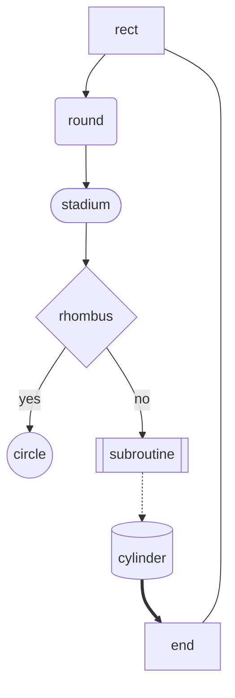

## flowchart — left to right, with a subgraph

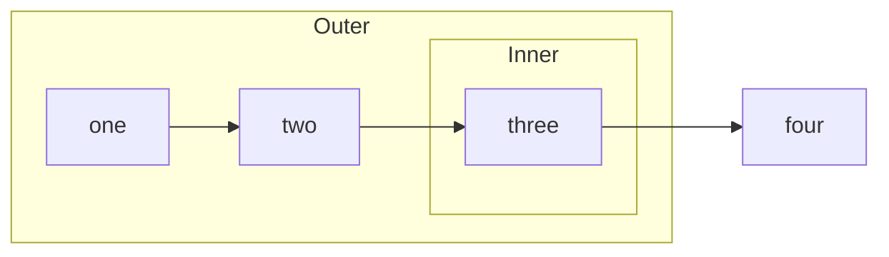

## sequenceDiagram — arrows, notes and blocks

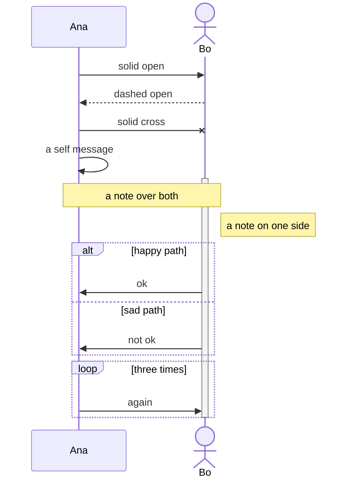

## classDiagram — compartments, visibility, stereotypes, relations

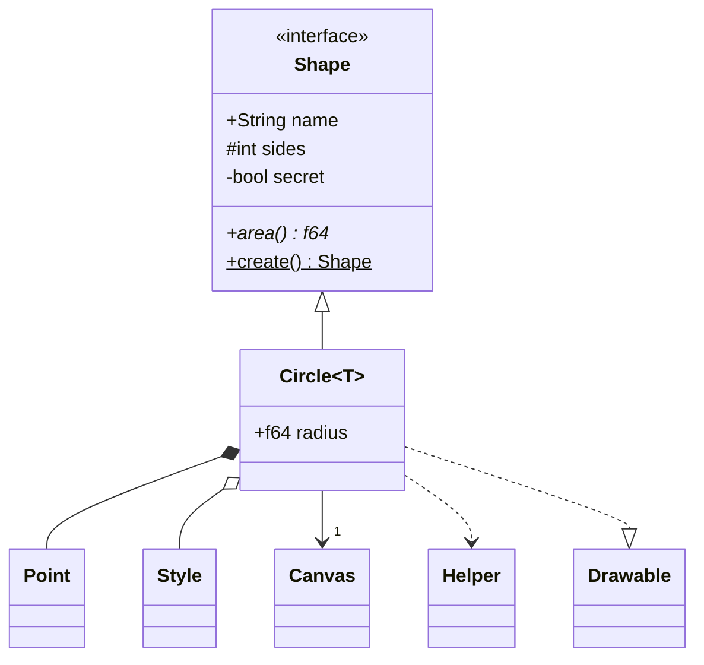

## erDiagram — attributes, keys, cardinalities

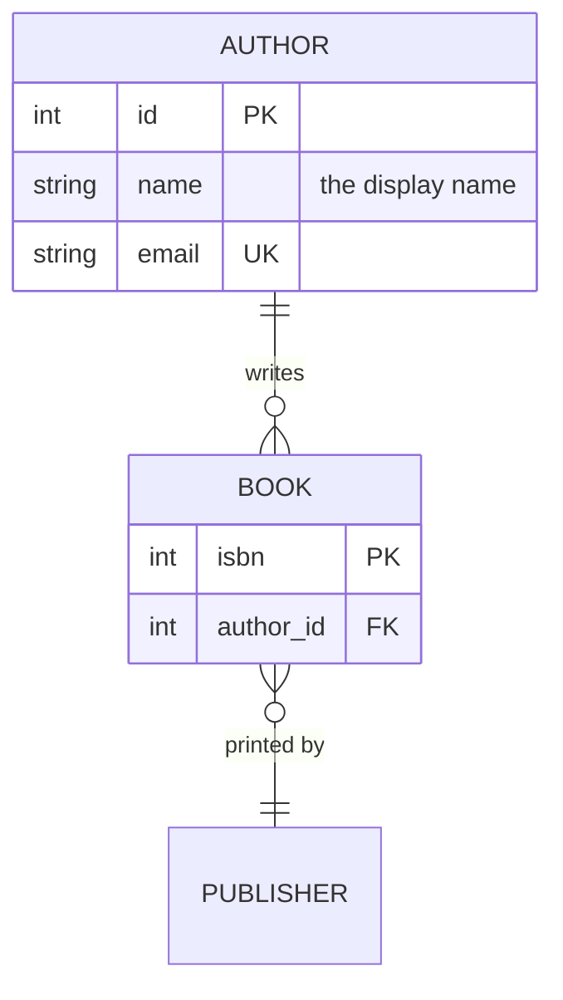

## stateDiagram-v2 — composites, choice, fork, notes

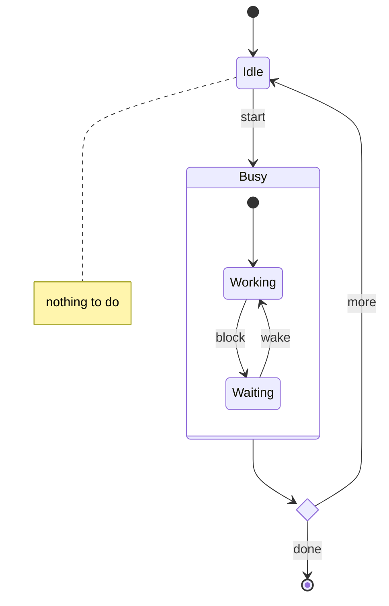

## pie

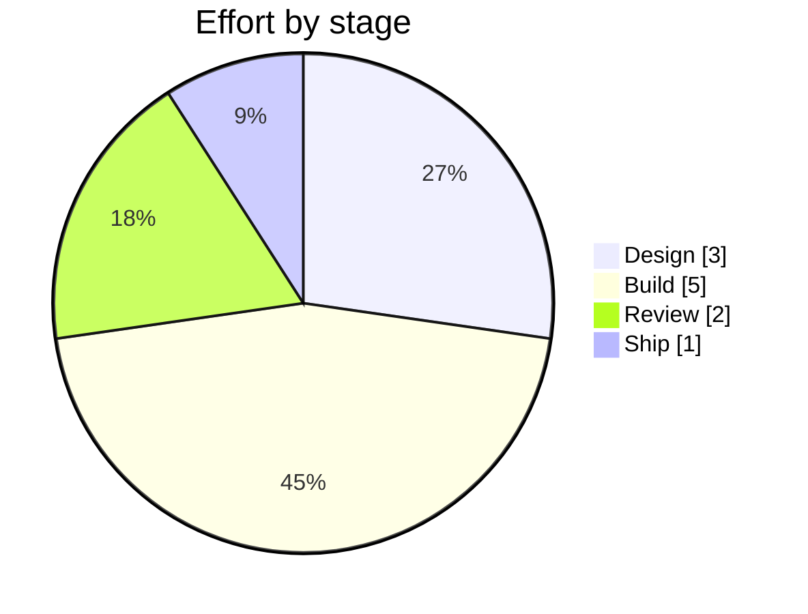

## gantt — sections, tags, dependencies

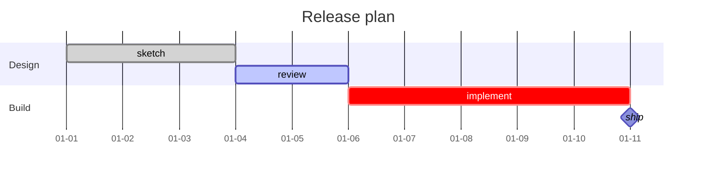

## Directives and comments are parsed and ignored

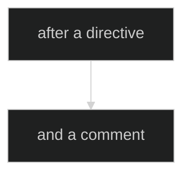

## Wider than eighty columns

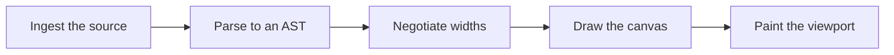

## Degenerate — a single node

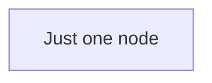

## Degenerate — an empty diagram

```mermaid
flowchart TD
```

## Not a supported diagram at all

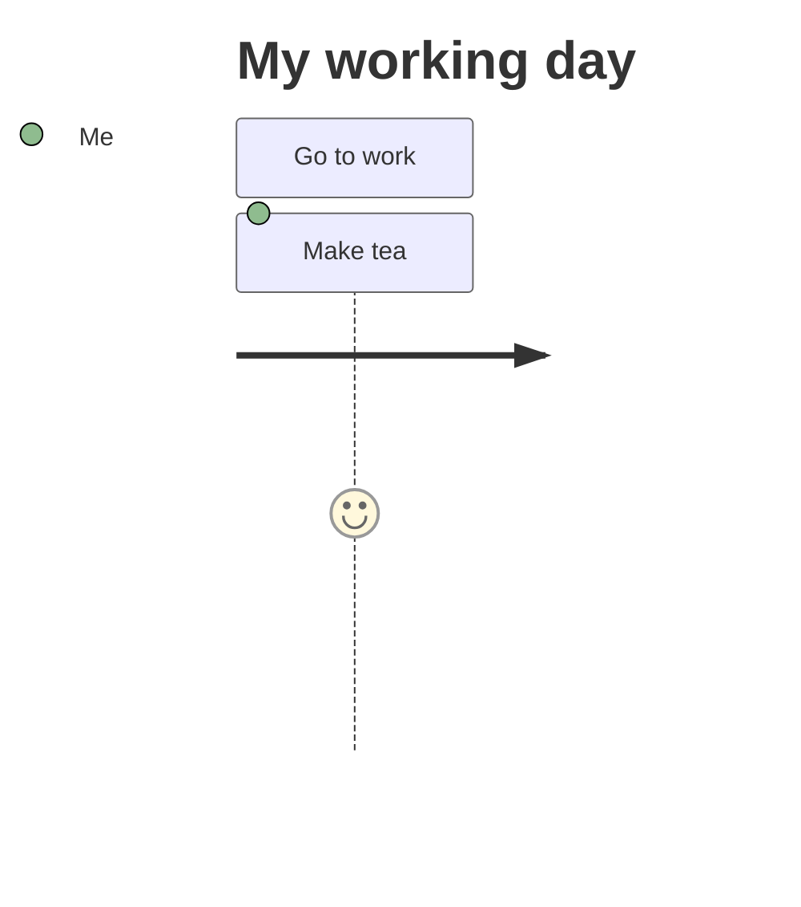

## Not valid mermaid at all

```mermaid
this is not valid mermaid at all
```
